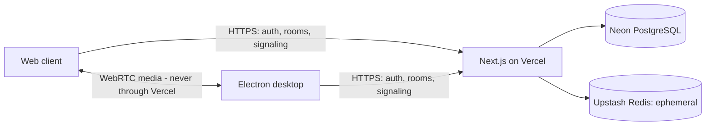
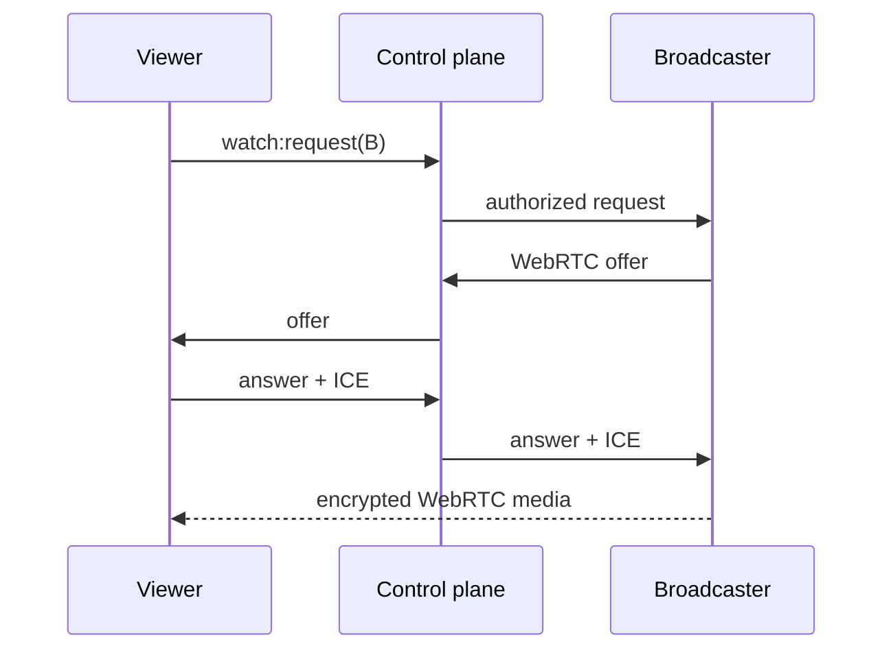

# JanjaLive architecture

JanjaLive is a private control plane around Chromium WebRTC. Persistent authorization lives in PostgreSQL; presence and signaling are ephemeral; media stays between participating clients. The web and Windows desktop applications are two clients of the same rooms, permissions and protocol.

## 1. Authentication

Auth.js uses Discord OAuth with only the `identify` scope. Discord is an identity provider, not a media transport. The stable Discord account ID is mapped to an internal user record. Cookies and OAuth protections are handled by Auth.js; every room and signaling endpoint derives the user from the server-side session.

The desktop client opens this same login in the system browser. A state- and PKCE-bound, five-minute, single-use handoff returns through `janjalive://auth/callback`. The backend requires the random one-time code delivered by that callback together with the app's matching state and private PKCE verifier; it does not offer a state-only polling exchange. The backend stores only hashes of the handoff and desktop session secrets. The reusable desktop token stays in Electron's main process and is encrypted at rest with `safeStorage`; the renderer receives only the signed-in user profile.

## 2. Persistent data

Neon PostgreSQL is the source of truth for users, rooms, authorized members, and join requests. Drizzle owns the schema and checked-in SQL migrations. Invite tokens, presence, WebRTC descriptions, ICE candidates, media, and stats are not persisted there.

## 3. Room membership

Membership is authorization. An authorized member remains listed while offline. `room_members.revoked_at` invalidates access without erasing the audit trail. Only the owner may approve, reject, revoke, regenerate an invite, or close a room. The owner cannot revoke themselves.

Room URLs contain a random 256-bit invite token. Only its SHA-256 hash is stored. A short room code is a convenience identifier and is never used by the signaling routes as proof of authorization.

## 4. Presence

Presence is an expiring Redis heartbeat, independent from membership. A browser is considered online only while recent heartbeats exist. Redis loss may temporarily hide presence but cannot change who is authorized.

## 5. Signaling

The client sends validated control events over short HTTPS requests and polls an ephemeral Redis queue. This serverless transport was selected because it behaves predictably on the Vercel Hobby tier and does not bind correctness to one warm Function instance. The client implements heartbeat, exponential backoff, and resynchronizes presence and active streams after reconnecting.

Every event is checked against the Auth.js session, active room, sender membership, and (for directed messages) target membership. Redis entries expire quickly. SDP and ICE candidates are never logged or copied to PostgreSQL.

## 6. WebRTC negotiation

Web and desktop both use the workspace package `@janjalive/webrtc`. Platform adapters provide only signaling requests and ICE configuration; peer creation, offer/answer handling, candidate buffering, lifecycle cleanup, retry timing and stream state live in the shared core. Runtime Zod schemas on both boundaries are exercised against the same protocol fixtures so either client cannot silently drift from the other.

When a viewer clicks **Assistir**, it sends `watch:request` to one broadcaster. Only then does the broadcaster create one `RTCPeerConnection`, attach its chosen screen stream, and exchange offer, answer, and ICE candidates through signaling. Other available streams consume no viewer bandwidth.

An established peer connection is not closed merely because signaling reconnects. Connections close on stop watching, broadcaster stop, native share end, revocation, room close, or component teardown. Room close, revocation, room exit and renderer teardown also stop every local capture track, preventing a capture from surviving its room context.

## 7. Media flow

Screen video and optional system audio travel through WebRTC. Vercel, Neon, and Redis never receive media frames. One broadcaster uploads approximately target bitrate multiplied by active viewers. This mesh is intentionally designed for a trusted group of roughly 2–8 people, not mass distribution.

## 8. Screen capture

Capture begins only after the user clicks **Compartilhar tela**. The browser-native picker is authoritative. JanjaLive shows the returned `MediaStream` in a large local preview, then applies best-effort constraints only after confirmation. Canceling stops every track. The native stop button is observed through `track.onended`.

On desktop, `desktopCapturer` stays in the main process. The renderer receives sanitized names, thumbnails and opaque expiring tokens—not Electron source IDs. Selecting one token creates a one-use grant for the top-level JanjaLive frame. `setDisplayMediaRequestHandler` consumes that grant and returns the selected source, with Windows loopback audio only when requested. Raw frames remain in Chromium and never cross IPC.

## 9. Audio

`getDisplayMedia({ audio: true })` requests system/source audio. The UI reports a track only when the browser actually returns one. No microphone or camera is requested. Windows Chrome/Edge is the primary target; source and browser restrictions are expected elsewhere.

## 10. Quality control

The UI offers resolution, frame rate, and simple Auto/High/Custom quality. Internally, presets map to sensible target bitrates. `applyConstraints` and `RTCRtpSender.setParameters` are best-effort browser hints; the product does not promise an exact encoded rate.

## 11. Security boundaries

- Identity and roles come from the session and database, never request fields.
- Invite tokens are high entropy and stored only as hashes.
- Zod validates every control-plane message.
- Directed signaling is restricted to active members of the same room.
- Security headers disable framing, camera, and microphone access.
- Logs redact keys associated with credentials, invitations, SDP, ICE, cookies, and IP addresses.
- Vercel Web Analytics records anonymous aggregate page views after sensitive route values are redacted. No custom analytics events, session replay, recording, VOD, chat, or media storage are included.

WebRTC media transport is encrypted. P2P peers may still learn network-address information during ICE negotiation; JanjaLive is deliberately intended for small trusted groups.

## 12. Failure and reconnect behavior

Signaling polling backs off after failures and returns to the normal cadence after recovery. Active streams and presence are resynchronized from Redis. Existing working media connections are kept alive. If no direct route can be established and no TURN fallback exists, the viewer sees a clear failure message.

## 13. P2P scalability limits

Each viewer creates an extra outbound encoding path at the broadcaster. At 10 Mbps, three viewers target roughly 30 Mbps outbound. Eight people is a UX target, not a hard cap. SFU, MCU, transcoding, recording, and automatic multi-stream download are intentionally out of scope.

## 14. TURN fallback

The default ICE configuration attempts direct media with Cloudflare STUN on ports `3478` and `53`. Production deployments should also configure `CLOUDFLARE_TURN_KEY_ID` and `CLOUDFLARE_TURN_API_TOKEN`: authenticated room members can then request short-lived TURN credentials from `/api/ice-servers` when a direct path is blocked by mobile networks, NAT or an operating-system firewall. WebRTC still prefers a direct route when one is available; without TURN, an unreachable session fails cleanly instead of remaining indefinitely connected to a black player.

## 15. Desktop isolation and updates

The packaged renderer is served from the private `janja-app://` scheme with Node integration disabled, context isolation, Chromium sandboxing, restrictive CSP, denied navigation/new windows and a narrow preload API. All privileged IPC handlers validate the exact main frame and parse their payloads.

The updater is fixed to the official GitHub Releases repository. Version tags trigger a Windows-only release workflow after frozen-lockfile installation, full web/desktop checks and a full-history Gitleaks scan. Electron-builder 26 generates SHA-512 update metadata; Windows artifacts remain unsigned until a real Authenticode certificate is available. Signed Ed25519 manifests will be adopted when the stable electron-builder line supports them.
